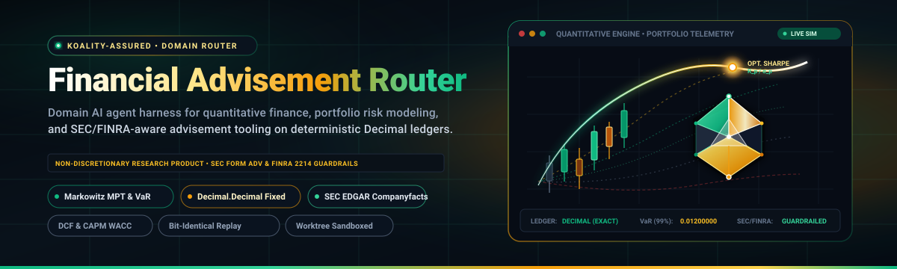
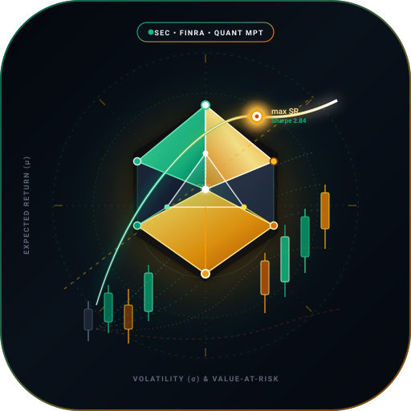
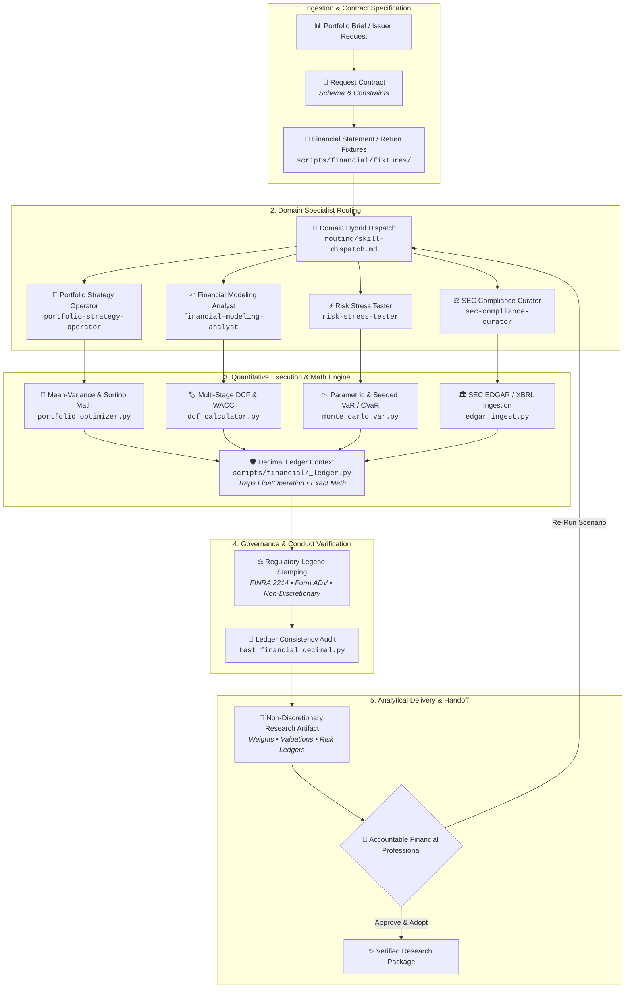

<div align="center">



<br/><br/>



# Financial Advisement Router

**Domain AI agent harness for quantitative finance, portfolio risk modeling, and SEC/FINRA-aware advisement tooling on deterministic Decimal ledgers.**

[](https://github.com/Koality-Assured/financial-advisement-router/actions/workflows/ci.yml)
[](LICENSE)
[](pyproject.toml)
[]()

</div>

---

> [!IMPORTANT]
> **NON-DISCRETIONARY FINANCIAL RESEARCH PRODUCT &mdash; FOR ANALYTICAL PURPOSES ONLY &mdash; NOT INDIVIDUAL INVESTMENT ADVICE**
>
> All models, simulations, weights, and metrics emitted by this harness are non-discretionary analytical tools and mathematical research products. They do not constitute personalized investment advice, endorsements, or solicitations under the Investment Advisers Act of 1940, SEC Regulation Best Interest (Reg BI), or FINRA rules. No customer nonpublic personal information (NPI) is ingested or retained.

---

## Overview

**Financial Advisement Router** is the domain-specialized AI orchestration router for quantitative modeling, portfolio risk analysis, valuation workflows, and regulatory compliance within the Koality-Assured ecosystem. Engineered as an authoritative financial spoke of `ai-harness-core`, it provides institutional-grade analytical tooling for quantitative strategists, investment committees, and compliance analysts.

Unlike generic LLM wrappers that hallucinate floating-point arithmetic or deliver unconstrained recommendations, Financial Advisement Router operates under strict domain engineering constraints:

- **Deterministic Decimal Ledgers**: All monetary amounts, asset weights, net asset values (NAV), hurdle rates, and loss quantiles execute strictly on Python `decimal.Decimal` (28-digit precision, `ROUND_HALF_EVEN`, `FloatOperation` traps enabled). Binary IEEE-754 floating-point numbers are rejected at the interface.
- **Statutory & Conduct Guardrails**: Mandatory enforcement of SEC Form ADV / Reg BI disclosure protocols and FINRA Rule 2214 requirements for hypothetical investment analysis tools.
- **Dedicated Specialist Agents**: Four domain-expert agents decoupled by mathematical responsibility (portfolio allocation, DCF valuation, stress testing, and EDGAR facts extraction).
- **Bit-Identical Seeded Replays**: Monte Carlo and bootstrap simulations execute with deterministic pseudorandom seeds, guaranteeing bit-for-bit replayability across platforms.
- **Sandboxed Worktree Execution**: All mutating scenario analysis and artifact generation run in ephemeral Git worktrees (`scratch/worktrees/<slug>`), keeping `main` pristine.

---

## Architecture & Lifecycle

The financial analysis lifecycle moves through five structured stages with strict validation gates:



### The 5 Operational Phases

1. **Ingestion & Contract Specification**: Validates input parameters (synthetic returns, asset bounds, hurdle rates, SEC CIKs) against strict schemas. Missing constraints are surfaced explicitly rather than assumed.
2. **Domain Specialist Routing**: Routes workloads to the exact domain specialist based on mathematical requirements, maintaining clean separation between valuation, allocation, and risk modeling.
3. **Quantitative Execution**: Computes portfolio weights, enterprise valuations, and loss distributions using audited Python mathematical engines running under decimal traps.
4. **Governance & Conduct Verification**: Stamps all analytical outputs with the non-discretionary research notice and FINRA Rule 2214 hypothetical tool disclosures before serialization.
5. **Analytical Delivery & Handoff**: Produces machine-readable JSON and human-readable Markdown summaries under `results/` for review by licensed financial professionals.

---

## Capabilities Matrix

Financial Advisement Router provides comprehensive quantitative modules tailored for portfolio management, corporate finance, and risk departments:

| Capability Domain | Mathematical & Analytical Methods | Regulatory & Operational Controls | Implementation Script |
| :--- | :--- | :--- | :--- |
| **Modern Portfolio Theory (MPT)** | Markowitz mean-variance optimization, minimum variance frontier, tangency maximum Sharpe ratio, target return solver, Sortino downside penalty grid. | Long-only constraints (`w_i >= 0`), unconstrained mode with short-sale bounds, non-discretionary stamp. | [`scripts/financial/portfolio_optimizer.py`](./scripts/financial/portfolio_optimizer.py) |
| **Value-at-Risk (VaR) & CVaR** | Historical quantile loss, parametric variance-covariance VaR, seeded bootstrap Monte Carlo simulation, Expected Shortfall (CVaR). | FINRA Rule 2214 hypothetical investment disclosure, deterministic seeds, bit-for-bit replayability. | [`scripts/financial/monte_carlo_var.py`](./scripts/financial/monte_carlo_var.py) |
| **Discounted Cash Flow (DCF)** | Multi-stage unlevered Free Cash Flow (FCF) projection, CAPM Weighted Average Cost of Capital (WACC), Gordon growth terminal valuation. | Terminal growth rate strictly capped at macro long-run GDP growth; two-way WACC/g sensitivity matrix. | [`scripts/financial/dcf_calculator.py`](./scripts/financial/dcf_calculator.py) |
| **SEC EDGAR & Filing Ingest** | Extraction of `data.sec.gov` company-facts JSON, CIK 10-digit zero-padding, US-GAAP XBRL tag resolution (10-K, 10-Q). | 10 req/sec fair-access rate limiter with backoff, recorded synthetic fixture fallbacks for air-gapped CI. | [`scripts/financial/edgar_ingest.py`](./scripts/financial/edgar_ingest.py) |
| **Fixed-Point Ledger Integrity** | Exact decimal arithmetic, 28-digit precision, `ROUND_HALF_EVEN`, `FloatOperation` trap catching unintended float casts. | Rejects IEEE-754 binary floats in cash balances, share counts, hurdle rates, and covariance structures. | [`scripts/financial/_ledger.py`](./scripts/financial/_ledger.py) |
| **Three-Statement Financials** | Synthetic balance sheet identity reconciliation (`Assets = Liabilities + Equity`), cash flow statement rollforwards. | Automated balance sheet identity assertions, debit-credit verification across synthetic accounting periods. | [`scripts/financial/fixtures/`](./scripts/financial/fixtures/) |

---

## Domain Specialist Agents

The repository provides four primary domain specialists, registered in [`routing/skill-dispatch.md`](./routing/skill-dispatch.md) and governed by [`docs/standards/financial-overlay.md`](./docs/standards/financial-overlay.md):

| Agent ID | Tier | Core Specialization | Primary Skill & Contract |
| :--- | :--- | :--- | :--- |
| [`portfolio-strategy-operator`](./ai-tooling/agents/portfolio-strategy-operator/AGENT.md) | High | Asset allocation, Markowitz mean-variance, Sharpe/Sortino optimization, and efficient frontier geometry. | [`portfolio-optimization`](./ai-tooling/skills/financial/portfolio-optimization/SKILL.md) &bull; Emits Decimal weight vectors and Sharpe scores. |
| [`risk-stress-tester`](./ai-tooling/agents/risk-stress-tester/AGENT.md) | High | Historical, parametric, and seeded bootstrap Value-at-Risk (VaR) and CVaR / Expected Shortfall. | [`risk-stress-simulation`](./ai-tooling/skills/financial/risk-stress-simulation/SKILL.md) &bull; Emits tail losses and FINRA 2214 legends. |
| [`financial-modeling-analyst`](./ai-tooling/agents/financial-modeling-analyst/AGENT.md) | High | Multi-stage DCF, CAPM WACC, terminal growth boundaries, and WACC/g sensitivity grids. | [`dcf-valuation-model`](./ai-tooling/skills/financial/dcf-valuation-model/SKILL.md) &bull; Emits enterprise value, equity value, and sensitivity tables. |
| [`sec-compliance-curator`](./ai-tooling/agents/sec-compliance-curator/AGENT.md) | Standard | SEC EDGAR company-facts JSON parsing, US-GAAP XBRL tag extraction, and Reg BI disclosure checklists. | [`sec-edgar-extract`](./ai-tooling/skills/financial/sec-edgar-extract/SKILL.md) &bull; Emits standardized GAAP fact tables. |

---

## Quickstart & CLI Validation

All financial engines and repository integrity checks can be executed directly via Python CLI:

### 1. Execute Unit Test Suite

Run the complete test suite covering fixed-point decimal arithmetic, DCF valuations, portfolio optimization, VaR quantiles, and harness routing:

```bash
python -m unittest discover -s scripts/tests -v
```

### 2. Portfolio Optimization (Mean-Variance & Sharpe)

Solve for optimal asset allocation weights using the synthetic asset returns fixture:

```bash
# Maximum Sharpe ratio portfolio (long-only)
python scripts/financial/portfolio_optimizer.py --objective max-sharpe

# Minimum variance portfolio with short positions allowed
python scripts/financial/portfolio_optimizer.py --objective min-variance --allow-short --json
```

Sample output:
```text
NON-DISCRETIONARY FINANCIAL RESEARCH PRODUCT - FOR ANALYTICAL PURPOSES ONLY - NOT INDIVIDUAL INVESTMENT ADVICE
SYN-A=0.76190476
SYN-B=0.19047619
SYN-C=0.04761905
```

### 3. Discounted Cash Flow (DCF) & Sensitivity Analysis

Calculate enterprise and equity valuation from multi-stage unlevered cash flows and WACC:

```bash
# DCF valuation with WACC / terminal growth sensitivity matrix
python scripts/financial/dcf_calculator.py --sensitivity
```

### 4. Monte Carlo Value-at-Risk (VaR) & CVaR Simulation

Execute seeded bootstrap risk stress tests with bit-identical reproducibility:

```bash
# 99% confidence seeded bootstrap simulation over 1,000 paths
python scripts/financial/monte_carlo_var.py --method bootstrap --confidence 0.99 --seed 42 --paths 1000 --json
```

Sample output:
```json
{
  "notice": "NON-DISCRETIONARY FINANCIAL RESEARCH PRODUCT - FOR ANALYTICAL PURPOSES ONLY - NOT INDIVIDUAL INVESTMENT ADVICE",
  "finra_2214_legend": "Projections are hypothetical, do not reflect actual investment results, and are not guarantees of future results.",
  "method": "bootstrap",
  "confidence": "0.99",
  "horizon_days": 1,
  "var": "0.01200000",
  "cvar": "0.01350000",
  "seed": 42
}
```

### 5. SEC EDGAR Company-Facts Ingestion

Extract US-GAAP facts from synthetic filings or live SEC EDGAR endpoints:

```bash
# Ingest recorded synthetic company facts
python scripts/financial/edgar_ingest.py --fixture scripts/financial/fixtures/synthetic_companyfacts.json --tags Assets,Revenues

# Live SEC pull (requires setting EDGAR_USER_AGENT environment variable)
python scripts/financial/edgar_ingest.py --live --cik 0000320193 --tags Assets,StockholdersEquity
```

### 6. Repository Structure & Link Validation

Validate all Markdown links, heading hierarchies, and routing configurations:

```bash
# Fast link and markdown structure check
python scripts/docs/validate_structure_fast.py --all

# Canonical 12-area repository layout verification
python scripts/docs/validate_router_structure.py
```

---

## Repository Taxonomy

Financial Advisement Router follows the standardized 12-area repository architecture:

| Directory | Purpose & Operational Role |
| :--- | :--- |
| [`actionable/`](./actionable/) | **Intake drop zone** &mdash; Unprocessed financial briefs, human requests, and analytical tickets. |
| [`ai-tooling/`](./ai-tooling/) | **Agent runtime** &mdash; Financial domain skills, agent contracts (`AGENT.md`), and memory checkpoints. |
| [`assets/`](./assets/) | **Branding identity** &mdash; Vector logos, hero banners, and repository graphic identity assets. |
| [`change-history/`](./change-history/) | **Provenance log** &mdash; Append-only audit records maintained strictly through automation scripts. |
| [`docs/`](./docs/) | **Authoritative standards** &mdash; Financial overlay specs, context rules, and security MUST documentation. |
| [`projects/`](./projects/) | **Initiatives** &mdash; Financial modeling initiatives, milestones, and quantitative research specs. |
| [`references/`](./references/) | **External standards** &mdash; Advisory reference materials (Conventional Commits, markdown specs). |
| [`research/`](./research/) | **Explorations** &mdash; Deep dives into asset pricing, volatility models, and quantitative literature. |
| [`results/`](./results/) | **Deliverables** &mdash; Generated allocation ledgers, valuation artifacts, and simulation summaries. |
| [`routing/`](./routing/) | **Dispatch layer** &mdash; Area map, skill dispatch catalog, and hybrid routing index. |
| [`scratch/`](./scratch/) | **Ephemeral workspace** &mdash; Sandboxed task worktrees (`scratch/worktrees/<slug>`) and scratch scripts. |
| [`scripts/`](./scripts/) | **Automation engine** &mdash; Python tools for financial math, worktree lifecycle, and verification. |
| [`supporting/`](./supporting/) | **Tool runtimes** &mdash; Technical guides for fixed-point arithmetic, EDGAR API patterns, and qmd discovery. |

---

## Operating Governance & Compliance

- **Non-Discretionary Mandate**: This repository produces analytical research tools, not discretionary trading software or personalized financial advice.
- **Data Privacy & Air-Gapping**: No nonpublic personal information (NPI), customer account balances, or proprietary trade secrets may be committed to this repository. All test suites operate on synthetic statements and anonymized return series.
- **Fair-Access Rate Limiting**: All external EDGAR data pulls adhere strictly to SEC fair-access limits (maximum 10 requests per second) and require explicit user-agent identification via `EDGAR_USER_AGENT`.
- **Zero-Drift Context Hierarchy**: AI coding agents adhere strictly to [`AGENTS.md`](./AGENTS.md) and [`routing/AGENTS.md`](./routing/AGENTS.md), loading area context Just-In-Time (JIT) without preloading.

---

<div align="center">
<sub>Crafted with precision for the Koality-Assured domain routing ecosystem.</sub>
</div>
